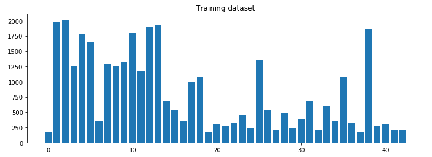
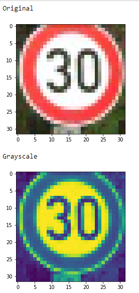
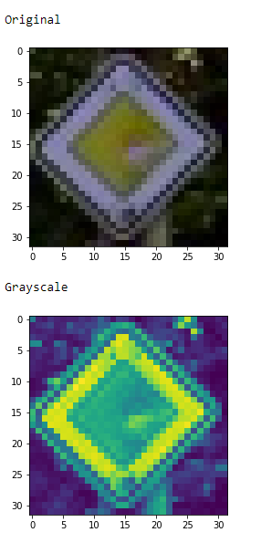
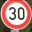
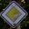

# **Traffic Sign Recognition** 

## Rubric Points
### Here I will consider the [rubric points](https://review.udacity.com/#!/rubrics/481/view) individually and describe how I addressed each point in my implementation.  

---
### Writeup / README

#### 1. Provide a Writeup / README that includes all the rubric points and how you addressed each one. You can submit your writeup as markdown or pdf. You can use this template as a guide for writing the report. The submission includes the project code.

Here is a link to my [project code](https://github.com/ektorasdev/Traffic-Signs-Classifier/blob/master/Traffic_Sign_Classifier.ipynb)

### Data Set Summary & Exploration

#### 1. Provide a basic summary of the data set. In the code, the analysis should be done using python, numpy and/or pandas methods rather than hardcoding results manually.

I used the pandas library to calculate summary statistics of the traffic
signs data set:

* The size of training set is 34799
* The size of the validation set is 4410
* The size of test set is 12630
* The shape of a traffic sign image is (32, 32, 1)
* The number of unique classes/labels in the data set is 43

#### 2. Include an exploratory visualization of the dataset.

Here is an exploratory visualization of the data set.

### Design and Test a Model Architecture

#### 1. Describe how you preprocessed the image data. What techniques were chosen and why did you choose these techniques? Consider including images showing the output of each preprocessing technique. Pre-processing refers to techniques such as converting to grayscale, normalization, etc. (OPTIONAL: As described in the "Stand Out Suggestions" part of the rubric, if you generated additional data for training, describe why you decided to generate additional data, how you generated the data, and provide example images of the additional data. Then describe the characteristics of the augmented training set like number of images in the set, number of images for each class, etc.)

The first step to preprocess the images is to create a copy of the image(so we won't edit the original), then on the copied image i add a conversion to grayscale using openCV cvtColor, then i resize the image to the dimensions we need for the training which is 32x32x1, after that i normalize the image and append it in the resulting array.

Why grayscale and normilize? Grayscaling is done to extract only the information we need to process the image and normalization is done to bring the image in a state that is more "normal" to process hence the word normalization.

Here is an example of a traffic sign image before and after grayscaling.

#### 2. Describe what your final model architecture looks like including model type, layers, layer sizes, connectivity, etc.) Consider including a diagram and/or table describing the final model.

My final model consisted of the following layers:

| Layer         		|     Description	        					| 
|:---------------------:|:---------------------------------------------:| 
| Input         		| 32x32x1 Grayscale Image   					| 
| Convolution 5x5     	| 1x1 stride, valid padding, outputs 28x28x6 	|
| RELU					|												|
| Max pooling	      	| 2x2 stride,  outputs 14x14x6 					|
| Convolution 5x5	    | 1x1 stride, valid padding, outputs 10x10x16 	|
| RELU					|												|
| Max pooling	      	| 2x2 stride,  outputs 5x5x16 					|
| Flatten				| inputs 5x5x16, outputs 400 					|
| Fully Connected		| inputs 400, outputs 120 						|
| RELU					|												|
| Fully Connected		| inputs 120, outputs 84 						|
| RELU					|												|
| Fully Connected		| inputs 84, outputs 43 						|
|						|												|
 

#### 3. Describe how you trained your model. The discussion can include the type of optimizer, the batch size, number of epochs and any hyperparameters such as learning rate.

The model was trained using Adam Optimizer. The batch size was 128 with 35 epochs and a learning rate of 0.001.

#### 4. Describe the approach taken for finding a solution and getting the validation set accuracy to be at least 0.93. Include in the discussion the results on the training, validation and test sets and where in the code these were calculated. Your approach may have been an iterative process, in which case, outline the steps you took to get to the final solution and why you chose those steps. Perhaps your solution involved an already well known implementation or architecture. In this case, discuss why you think the architecture is suitable for the current problem.

My final model results were:
* validation set accuracy of 93% 
* test set accuracy of 93%

To train the model i used the LeNet architecture. I started the training by having a learning rate of 0.006, 10 epochs, 150 batch size and a probability of 1.0. With these variables i was able to get a 98% validation accuracy but the maximum test accuracy i was getting was only 90%. Then i decided to make a change by removing the probability factor and increase the epochs to 25. With that after a few training sets i got a result of 91.3%. So i decided to tune the variables even more and after a lot of training examples i managed to get a 93% test validation with a learning rate of 0.001, 35 epochs and 128 batch size.
 

### Test a Model on New Images

#### 1. Choose five German traffic signs found on the web and provide them in the report. For each image, discuss what quality or qualities might be difficult to classify.

From the German Traffic Signs i've provided 6 images:

The difficulties for these signs where mostly due to the background of each sign or based on the shape. For example a bad lightning can wrongly classify an image or a blurry triangle image might be classified as circled.

#### 2. Discuss the model's predictions on these new traffic signs and compare the results to predicting on the test set. At a minimum, discuss what the predictions were, the accuracy on these new predictions, and compare the accuracy to the accuracy on the test set (OPTIONAL: Discuss the results in more detail as described in the "Stand Out Suggestions" part of the rubric).

From the prediction of the custom images the result where as followed:

| Image			        |     Prediction	        					| 
|:---------------------:|:---------------------------------------------:| 
| Speed limit (30km/h)  | Roundabout Mandatory   						| 
| Priority road  		| Priority Road 								|
| Yield					| Yield											|
| No entry	      		| No Entry  					 				|
| Stop					| Road work  									|

The model was able to correctly guess 3 of the 5 traffic signs, which gives an accuracy of 60%. That's really low compared to the test accuracy which is 93%, but this result is only with 5 images, so we are expecting a better result closer to the test accuracy if we had more images to classify.

#### 3. Describe how certain the model is when predicting on each of the five new images by looking at the softmax probabilities for each prediction. Provide the top 5 softmax probabilities for each image along with the sign type of each probability. (OPTIONAL: as described in the "Stand Out Suggestions" part of the rubric, visualizations can also be provided such as bar charts)

The result of the prediction of each i got was as follows:

For the speed limit 30km/h the correct label is 1 but the prediction result was:
Probabilities: [0.05825923 0.02340354 0.02240251 0.02239837 0.02239836]
Classes: [40 37 20 10  0]

For the priority road the correct label is 12 and the result was:
Probabilities: [0.0607866  0.02236228 0.02236223 0.02236222 0.02236222]
Classes: [12 38 40  0  1]

For the yield the correct label is 13 and the result was:
Probabilities: [0.06078678 0.02236221 0.02236221 0.02236221 0.02236221]
Classes: [13  0  1  2  3]

For the no entry the label is 17 and the result was:
Probabilities: [0.06078678 0.02236221 0.02236221 0.02236221 0.02236221]
Classes: [17  0  1  2  3]

For the stop the label is 14 and the result was:
Probabilities: [0.03996198 0.03338726 0.02334022 0.02264303 0.0226068 ]
Classes: [ 9 28 13 38 40]
